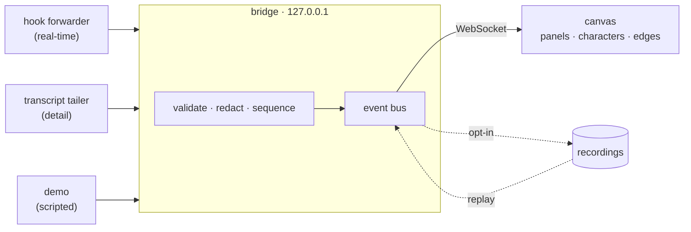

<div align="center">

# visual-workflows

### Watch your AI agents work. A live, animated mission control for Claude Code.

[](LICENSE)
[](package.json)
[](#status)
[](#privacy)

<br/>


<br/>
<em>Real footage. One local command. No account, no cloud, no setup.</em>

</div>

<br/>

Claude Code can run a whole team of agents at once. Today you watch them through tiny expandable rows, one click at a time. **visual-workflows** turns that run into a live map: every agent is a panel on a canvas, wired to the ones it spawned and feeds, with its own terminal and a little character that thinks, types, runs tests, raises a hand for approval, or slumps when something breaks. You see the whole thing at a glance, and you can replay it afterward.

## Try it in 20 seconds

```bash
git clone https://github.com/aadityasp/visual-workflows.git
cd visual-workflows
npm install
npm start
```

That builds the UI, starts a local server, and opens the dashboard. Click **Run the demo** and watch a full 7-agent run play out. **No Claude Code required.** The only thing you need is Node 22+.

> Publishing to npm (so this collapses to a single `npx visual-workflows`) is a [roadmap](docs/ROADMAP.md) item; today it runs from a clone.

## What you get

|                                        |                                                                                                                                                  |
| -------------------------------------- | ------------------------------------------------------------------------------------------------------------------------------------------------ |
| 🎬 **A canvas that comes alive**       | Agents appear and connect as they spawn. Parallel work stacks into a column, so you _see_ what is concurrent and what is waiting.                |
| 🤖 **Characters with a pulse**         | Each agent has a tiny animated crew member whose pose is its status: thinking, reading, writing code, testing, blocked, done. Never color alone. |
| 🖥️ **Terminals, inline**               | Live output streams inside every panel. Double-click any agent for a full terminal with files, tools, and details.                               |
| ⏪ **Replay any run**                  | Scrub a finished workflow back and forth. The entire UI is a pure function of an event log, so live and replay share one code path.              |
| 🖐️ **Only interrupts when it matters** | Approvals, blockers, and failures slide into an attention rail. Click one, the camera flies to that agent. Everything else stays calm.           |
| 🔒 **Yours, locally**                  | Binds to `127.0.0.1`, zero telemetry, secrets redacted before they ever reach the screen.                                                        |

## Connect your own Claude Code

The demo needs nothing. To watch your **real** sessions:

```bash
npm run vw -- connect     # register hooks (prints the exact settings diff first)
npm start                 # then open the dashboard and start a session in Claude Code
```

> The `--` after `vw` is required so npm passes the flags through to the tool rather than eating them.

Prefer the hands-off version? Add `--auto-open`:

```bash
npm run vw -- connect --auto-open
```

Now the dashboard **opens itself** the first time a Claude Code session spawns agents (starting the bridge if it is not already up), and offers to **close when the run ends** (a 5-second countdown with a "Keep open" button, since you often want to stay and replay). True auto-close needs a Chromium-family app window, which it uses automatically when available; in a plain tab it shows a clear "safe to close" prompt instead. You can also open it any time from inside a session with the `/visual-workflows` slash command (via the plugin).

`connect` is deliberately boring and fully reversible: it prints the exact `settings.json` diff before writing, backs up your file, only touches its own entries, and installs a hook that just reads → redacts → posts to localhost and always exits in under 2 seconds. Undo any time with `npm run vw -- disconnect` (which also turns auto-open off).

It reads two things Claude Code already writes: **hooks** (real-time) and the **session transcript files** (detail). It never drives your agents. Multi-agent `/gsd` runs show up as labeled waves automatically.

> Verified against Claude Code **v2.1.212**. Its hook and transcript formats are not a public API, so the adapter tags what it is verified against and skips anything it does not recognize rather than guessing. Details in [docs/ADAPTERS.md](docs/ADAPTERS.md).

## How it works



One idea runs the whole thing: **`state = reduce(events)`**. Adapters translate what Claude Code does into a small event stream; the bridge sequences it; the UI, recordings, and the replay scrubber all replay it through the same pure reducer. The socket is observation-only by construction, no frame can execute anything. Deeper dive: [docs/ARCHITECTURE.md](docs/ARCHITECTURE.md).

## Status

340 unit + integration tests, all green, plus a Playwright end-to-end suite (run locally; non-blocking in CI while stabilizing). Typecheck, lint, and production build clean. `npm audit`: 0 vulnerabilities. Built and hardened through an adversarial multi-agent code review.

<sub>Demo data is scripted and always wears a `DEMO` badge, so simulated activity can never be mistaken for a real session.</sub>

## <a id="privacy"></a>Privacy

No network calls leave your machine. No analytics, no update pings. The local server is gated by a per-install token, secrets are stripped at ingestion before the UI or any recording sees them, and there is no code path from this app back into your agents. Full threat model: [SECURITY.md](SECURITY.md).

## Roadmap

Verified approvals and OpenTelemetry (v0.2) → Codex / Gemini adapters, a Tauri desktop app, and a VS Code panel (v0.3) → community character packs (v0.4). Full list: [docs/ROADMAP.md](docs/ROADMAP.md).

## Contributing

Node 22 is the only prerequisite. `npm install && npm run dev` gives you a live system; click **Run the demo** for sample data. Adding a character pack is the designated good first PR. See [CONTRIBUTING.md](CONTRIBUTING.md).

## Keyboard

`?` shortcuts · `o` fit · `f` follow · `Enter` focus · `Esc` back · `Tab` cycle · `1` to `9` jump to attention · `m` minimap · `t` theme · `Space` replay · `Shift+F` fullscreen

<details>
<summary><strong>How it compares</strong></summary>

<br/>

There is a small, healthy ecosystem of Claude Code observability tools. Two worth calling out, both good and both worth your time:

- **[agent-flow](https://github.com/patoles/agent-flow)** renders agent orchestration as an interactive node graph with real-time tool calls and multi-session tabs, and also tails Codex. If you want a clean abstract flow graph with Codex support today, it is excellent.
- **[Claude-Code-Agent-Monitor](https://github.com/hoangsonww/Claude-Code-Agent-Monitor)** is a full local dashboard: session analytics, a Kanban board, a health score, plus a menu-bar app and a VS Code extension. If you want dashboards and analytics today, start there.

visual-workflows leans a different way: **a per-agent animated character and an inline terminal in every panel, plus replay, on one live spatial canvas**, driven by verified events, local-first. That specific combination is the wedge. The projects above each do parts of it, and things visual-workflows does not.

</details>

## Disclosure

Independent open-source project, not affiliated with, endorsed by, or sponsored by Anthropic. "Claude" and "Claude Code" are trademarks of Anthropic, PBC, used only to describe compatibility. Not affiliated with the gsd project either; gsd runs are simply one thing the adapter can watch.

## License

[MIT](LICENSE)
