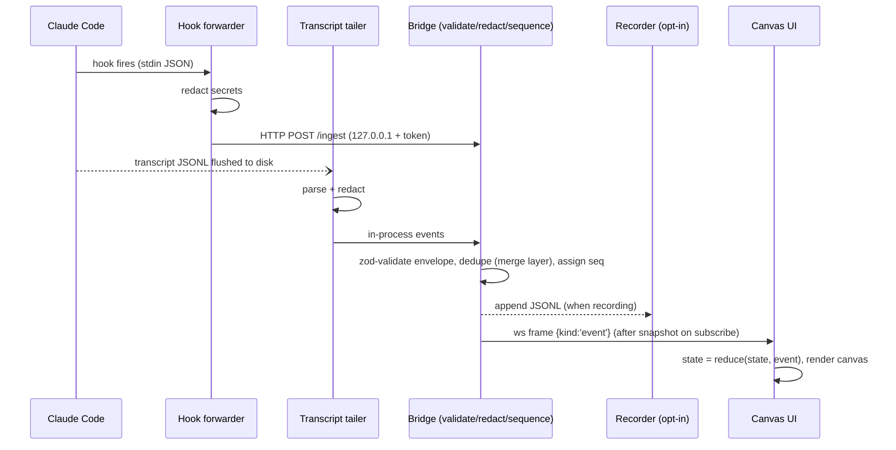
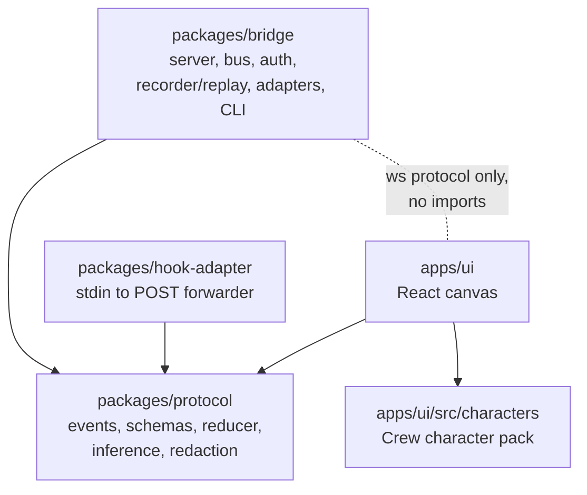

# Architecture

How visual-workflows turns an opaque multi-agent session into a live, replayable canvas, and why
it is shaped the way it is. Decision rationale lives in [adr/ADR.md](adr/ADR.md); the wire
contract lives in [EVENT_PROTOCOL.md](EVENT_PROTOCOL.md).

## The one idea

Everything is an append-only event log plus one pure reducer:

```
WorkspaceState = reduce(events)
```

Adapters observe work happening (Claude Code hooks, transcript files, or the scripted demo) and
translate it into typed protocol events. The bridge validates, sequences, and fans those events
out. The UI folds them into state. A recording is literally the event list, so replay, scrubbing,
and the live view are the same code path with a different clock.

## Event flow



On subscribe the bridge sends a `snapshot` frame (the reducer output so far) and then streams
events with `seq > snapshot.lastSeq`; reconnects pass `fromSeq` for gapless resume. `seq` is the
only ordering authority; `ts` is display-only because adapter clocks may skew.

## Package boundaries



Rules (from [COMPONENT_MAP.md](COMPONENT_MAP.md), enforced in review):

1. `protocol` depends on nothing internal. It is the contract; everyone depends on it.
2. `ui` never imports from `bridge`. They share only the WebSocket frame types defined in
   `protocol`. This keeps the UI honest: it can only know what any consumer could know.
3. `hook-adapter` depends only on `protocol`'s redaction and must stay tiny (no runtime deps):
   it executes on every hook fire inside someone's coding session, so its worst case must be
   "did nothing, exited 0, in under 2 seconds".
4. Adapters implement one interface; removing one degrades coverage but breaks nothing.

## Reducer and replay design

The reducer (`protocol/src/reduce.ts`) is deterministic and tolerant:

- **Deterministic**: no clocks, no randomness; `seq` ordering only. The same event list always
  produces the same state, which makes snapshots trustworthy and fixtures trivial (events in,
  state out).
- **Tolerant**: events referencing unknown sessions/agents create stubs (order of arrival is not
  guaranteed across two adapters); unknown event types are counted and ignored; duplicate `seq`
  values are dropped.
- **Bounded**: per-agent caps (output tail, tool calls, commands, file touches, attention items)
  keep memory flat over long sessions; the full output stream lives in the bridge's ring buffer,
  not in reducer state.
- **Two-axis status**: agents track `lifecycle` (created/running/blocked/awaiting_approval/
  awaiting_input/failed/completed/cancelled) and `activity` (thinking/reading/searching/
  writing_code/running_command/testing/reviewing/...). Adapters report facts; `infer.ts` is the
  single place tool names become activities (e.g. `Bash` + a test-runner pattern = `testing`).
  Character animation is derived from both axes.

Replay is not a feature bolted on top; it falls out: a recording is a JSONL header plus the event
lines ([format](../examples/recordings/README.md)). The replay driver feeds lines through the same
reducer with a virtual clock built from `ts` deltas; scrub-to-seq is `reduce(events where seq <= N)`.

## Adapter merge layer

Two independent Claude Code adapters cover each other's blind spots (ADR-002):

|           | Hook forwarder                              | Transcript tailer                                  |
| --------- | ------------------------------------------- | -------------------------------------------------- |
| Mode      | Push, real-time                             | Pull (fs watch), slight lag                        |
| Sees      | Lifecycle, tool calls, subagent attribution | Output text, thinking, diffs, token usage, errors  |
| Misses    | Output text, usage                          | Nothing on disk, but only after flush              |
| Fragility | Hook payloads (verified per version)        | Undocumented on-disk format (verified per version) |

Both may report the same fact. The merge layer dedupes on (`session_id`, `tool_use_id`) with
source precedence: hooks win on timing (first to arrive), the tailer enriches afterwards
(emitted as follow-up events like `agent_output` and `agent_tool_completed` detail, never as
duplicates). The reducer is additionally idempotent on `toolCallId`/`commandId`, so even an
imperfect merge cannot double-count. Either adapter alone still yields a correct, degraded stream;
demo mode needs neither.

## Security shape

Covered fully in [SECURITY_MODEL.md](SECURITY_MODEL.md); the architectural facts: the bridge binds
`127.0.0.1` only and requires a per-install token for `/ingest` and `/ws`; redaction runs in
adapters before events reach the bus, so downstream code and recordings never see raw secrets; and
the ws protocol contains no frame that executes anything, making "the dashboard drove my agents"
structurally impossible rather than configured away.

## Extension points

- **Adapter interface** (`packages/bridge/src/adapters/types.ts`): implement start/stop and emit
  protocol events. This is the seam for the roadmap's OpenTelemetry receiver and Codex/Gemini CLI
  tailers; consumers cannot tell adapters apart except by the `source` label.
- **Character packs**: a manifest plus per-variant components implementing the 14-state contract
  ([CHARACTER_SYSTEM.md](CHARACTER_SYSTEM.md)). v1 packs are compiled in via the registry;
  runtime loading waits on a sandboxing story.
- **Protocol extensions**: new event types and payload fields are non-breaking by contract; every
  consumer is a tolerant reader. `v` bumps only for envelope breaks.
- **Recordings as an interchange format**: anything that can write the JSONL shape can be
  replayed; anything that can read it can analyze runs offline.
